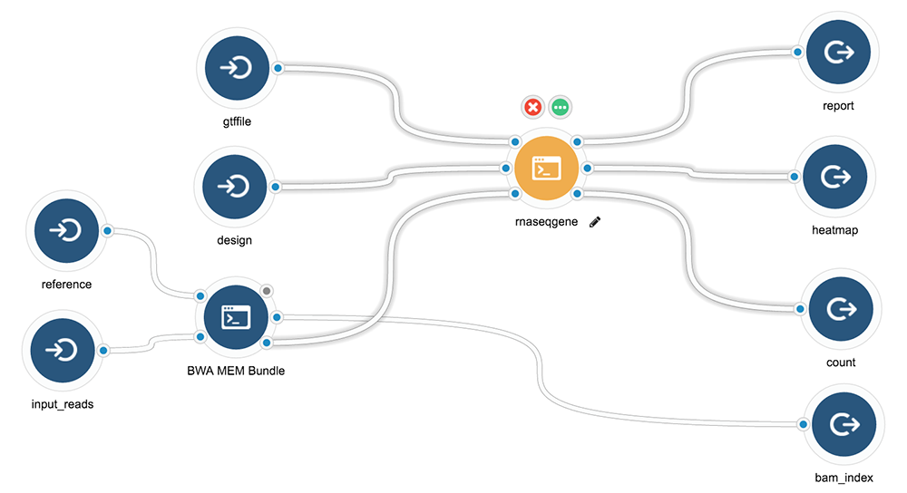

<!--
%\VignetteIndexEntry{Tutorial: make the best of bioconductor workflows}
%\VignettePackage{sevenbridges}
%\VignetteEngine{knitr::rmarkdown}
-->

## Introduction

__Goal__: I hope to encourage Biocondcutor developer and R developers to find a formal way to make their tool/flow into a reproducible container with standard command line interface or provide official "executable" report template with knitr. (Hope to have more fun with liftr soon later).

In this tutorial, I will show you 

1. Wrap existing bioconductor workflow into a container
2. Provide command line interface for your container app
3. Provide template report for your container app
4. Run it anywhere include
    - Locally
    - Cancer genomics cloud
    - Google 
    - AWS 
5. Check they are the same

## RNA-seq analysis pipeline


### Creat a Tool: from Bam to report

#### Step 1: have a plan 

To demonstrate I will use a RNA-seq [workfow](https://www.bioconductor.org/help/workflows/rnaseqGene/) from Bioconductor, I want to 
make it into a tool and allow you to input new files and generate new report. 

Before you build a tool, you have to have a plan in mind

1. What Input, Output and Parameter you want to define for the tool
2. Is there a container available for your tool? do you want to build one with command line interface?

First thing first, let's define our tool first, here is a diagram generated with Seven Bridges' graphical user interface. 


- Input 
    - Gene feature file
    - A list of bamfiles
    - Desgin matrix
- Output
    - Report in pdf, using the Rmarkdown associated with this workflow and example
    - Graphics
    - DE table


#### Step 2: Create docker container for your tool

Why we do this first? Building a development environment is essential for developing your command line interface, so we should get everything prepared. There
are some principles 

1. First you need to check is there any existing container you can directly use, so you don't have to make a new one. 
2. If you don't want to make a new container with command line interface and you just want making a working cwl app and could be exeucte somewhere, then you can you simply insert script in cwl.
3. If you think a cool command line interface is worth doing, and convenient in any case, then go ahead and make one and create our own container will be a better idea. this allow you to provide much formal interface at both command line level or container level. 

Her is Dockerfile I used to generate the workflow I need

```{r}
fl <- system.file("docker/rnaseqgene", "Dockerfile", 
                  package = "sevenbridges")
fl
```

Here is the current content of Dockerfile
```{r comment=''}
cat(readLines(fl), sep = '\n')
```

I does couple things

1. Install workflow I need and all dependencies
2. Insert command line interface I created, make it executable and in PATH
3. Insert report template I am using 

In next section, I will show you how to create command line interface

#### Step 3: Create your command line interface.

In this step, I am going to

1. Use docopt to make R command line interface
2. Insert my script into the container I made
3. Test function inside container 

Here is the command line I am using it's called "performDE.R"

```{r}
fl <- system.file("docker/rnaseqgene/src", "performDE.R", 
                  package = "sevenbridges")
fl
```

Here is the current content of Dockerfile
```{r comment=''}
cat(readLines(fl), sep = '\n')
```

I am using `docopt` package instead of `commandArgs` because it allows you to create
a formal interface. 

Sometime you want to produce a report, so in the end you will notice how I pass parameters from command line to a report. 

#### Step 4: Describe your tool in R into CWL.

Tool is the simple basic unit of a workflow, you can put the whole flow in one 
container and one tool, it of course works, just make it hard to factorize components. 
This is the exact example, I can make one tool for DESeq2 and one tool for Rsamtools, I can also 
put everything I need in one tool and provide single functionality. 

Note: you can use single docker image, but describe as many tools as you want if it contains what you need. 

Follow the example to create Tool with `Tool` function. It's straightforward. Especially if you are 
familiar with Seven Bridges Tool editor already. 

```{r}
library(sevenbridges)

rbx <- Tool(id = "rnaseqGene", 
            label = "rnaseqgene",
            description = "A RNA-seq Differiencial Expression Flow and Report",
            hints = requirements(docker(pull = "tengfei/rnaseqgene"), cpu(1), mem(2000)), 
            baseCommand = "performDE.R", 
            inputs = list(
                input(
                    id = "bamfiles", label = "bam files",
                    description = "a list of bam files",
                    type = ItemArray("File"),
                    prefix = "--bamfiles",
                    itemSeparator = ","
                ), 
                input(
                    id = "design", label = "design matrix",
                    type = "File",
                    prefix = "--design"
                ),
                input(
                    id = "gtffile", label =  "gene feature files",
                    type = "File",
                    prefix = "--gtffile"
                )
            ),
            outputs = list(
                output(id = "report", label = "report", 
                       description = "A reproducible report created by Rmarkdown",
                       glob = "*rnaseqGene.pdf"),
                output(id = "heatmap", label = "heatmap", 
                       description = "A heatmap plot to show the Euclidean distance between samples",
                       glob = "heatmap.pdf"),
                output(id = "count", label = "count", 
                       description = "Reads counts matrix",
                       glob = "*.csv")))

```

By default it output YAML, but you can print it into JSON as well. 

```{r}
rbx
rbx$toJSON(pretty = TRUE)
rbx$toJSON()
## or write to external file
## fl <- "~/Downloads/rnaseqGene.json"
## write(rbx$toJSON(pretty = TRUE), fl)
```

#### Step 5: Execute your tool with a new task.

Now let's create a task and execute it with example files. 

```{r, eval = FALSE}
library(sevenbridges)
## load from preset authentification
a <- Auth(username = "tengfei", platform = "us")
## Load the project
(p <- a$project(id = "tengfei/rnaseqgene"))

## get files you need as inout
(bamfiles.in <- p$file(".bam"))
(design.in <- p$file("sample_table.csv"))
(gtf.in <- p$file("Homo_sapiens.GRCh37.75_subset.gtf"))

## add App you just created 
(rna.app <- p$app_add("rnaseqgene6", rbx))

## add a new Task
(tsk <- p$task_add(name = "RNA DE report new", 
                   description = "RNA DE analysis report", 
                   app = rna.app$id,
                   inputs = list(bamfiles = bamfiles.in, 
                                 design = design.in,
                                 gtffile = gtf.in)))

## run the task
tsk$run()

## monitor the task
tsk$monitor()
```


#### Step 6: Execute it anywhere

You can simply copy paste your JSON file to any platform that support cwl execution. 


#### Step 7: Share your tools

Sharing is as easy as share a plain text file of JSON. You can email, or just forward a link to your 
collaborators. 


### Create a workflow

__In progress__

Next we want to connect what we have here with existing tools. So let's assume your input file
now is not a list of bams, but a list of fastq, so you need to do alignment first. 

It's quite easy, just connect another tool that do the job for you, which translate
a fastq to bam. 

Down here is the example. I just connect _bwa-mem_ with this tool 




    
